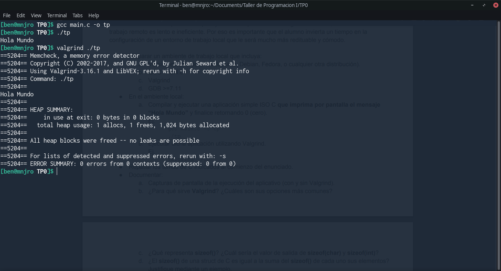
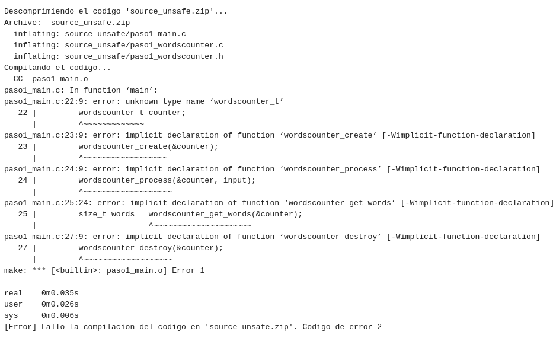
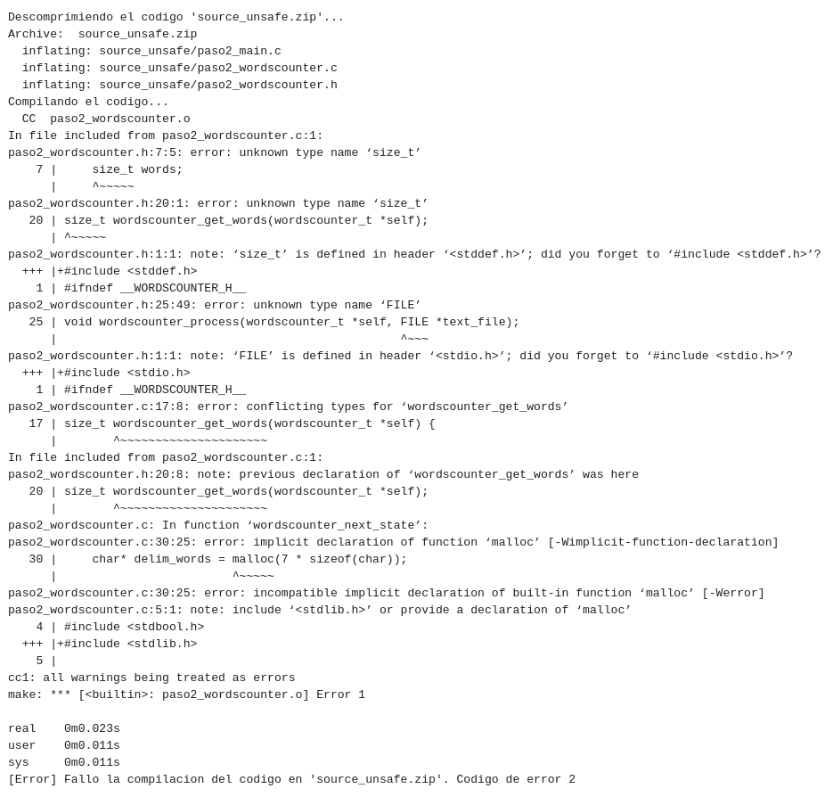
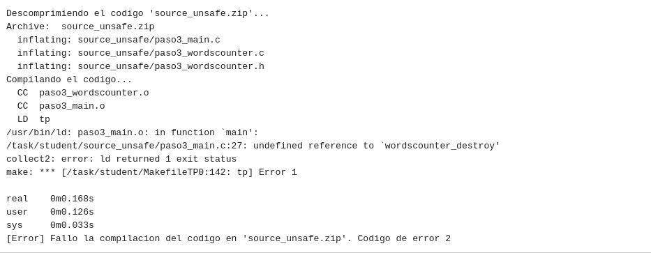

# TP0

Nombre completo: Sebastian Bento Inneo Veiga

Padron: 100998

Link: https://github.com/SBen-IV/tp0

## Paso 0: Entorno de Trabajo

**a.** Capturas de pantalla de la ejecución del aplicativo (con y sin Valgrind).



**b.** ¿Para qué sirve Valgrind? ¿Cuáles son sus opciones más comunes?

Valgrind es usado para detectar mal uso de memoria en un programa, por ejemplo, al hacer uso de `malloc()` sin haber hecho `free()`.

**c.** ¿Qué representa sizeof()? ¿Cuál sería el valor de salida de sizeof(char) y sizeof(int)?

`sizeof()` es una función que devuelve el tamaño en bytes del tipo de dato de la variable que se le pasa por parámetro. El valor que devuelva va a depender de la arquitectura en la que se encuentre el programa, por ejemplo, en 32 bits el tamaño de un `short` será de 2 bytes mientras que en 64 bits será de 4 bytes.

**d.** ¿El sizeof() de una struct de C es igual a la suma del sizeof() de cada uno sus elementos?
Justifique mediante un ejemplo.

En la mayoría de los casos esto no es cierto, por ejemplo, si se tiene la estructura (en 32 bits):

```c
typedef struct Ejemplo{
	short a;
	int b;
};
```
`sizeof(short)` + `sizeof(int)` = 2 + 4 = 6, pero si hacemos `sizeof(Ejemplo)` = 8 =! 6.

Esto ocurre porque se agrega un *padding* a la estructura de modo que sus miembros queden en direcciones de memoria múltiplos de 4. En este caso queda así:

0 | 1 | 2 | 3
------|-------|----|----
short | short | x | x
int | int | int | int 

(x = padding)

**e.** Investigar la existencia de los archivos estándar: STDIN, STDOUT, STDERR. Explicar
brevemente su uso y cómo redirigirlos en caso de ser necesario (caracteres > y <) y como
conectar la salida estándar de un proceso a la entrada estándar de otro con un pipe (carácter
| ).

STDIN: Se usa para almacenar lo que se ingresa por teclado. Se puede redirigir con `porgrama1 < programa2`.

STDOUT: Se usa para almacenar lo que se imprime por pantalla en la terminal. Se puede redirigir con `programa1 > programa2` o `programa1 1> programa2`. 

STDERR: Se usa para almacenar la salida sobre errores de los programas. Se puede redirigir con `programa1 2> programa2`.

Para conectar la salida estándar con la entrada estándar de 2 procesos se puede usar un pipe de la siguiente manera:

`programa_con_salida_estandar | programa_con_entrada_estandar`


## Paso 1: SERCOM - Errores de generación y normas de programación

**a.** Captura de pantalla mostrando los problemas de estilo detectados. Explicar cada uno.

```
/task/student//source_unsafe/paso1_wordscounter.c:27:  Missing space before ( in while(  [whitespace/parens] [5]
```
Hace referencia a que falta un espacio antes del `(` del `while` en el archivo `paso1_wordscounter.c` en la línea 27.
```
/task/student//source_unsafe/paso1_wordscounter.c:41:  Mismatching spaces inside () in if  [whitespace/parens] [5]
```
La cantidad de espacios entre `(`, la condición y `)` no es igual en el archivo `paso1_wordscounter.c` en la línea 41.
```
/task/student//source_unsafe/paso1_wordscounter.c:41:  Should have zero or one spaces inside ( and ) in if  [whitespace/parens] [5]
```
Parecido al error anterior, indica que deben haber 1 o ningún espacio dentro de los paréntesis `()` en el archivo `paso1_wordcounter.c` en la ĺínea 41.
```
/task/student//source_unsafe/paso1_wordscounter.c:47:  An else should appear on the same line as the preceding }  [whitespace/newline] [4]
```
Al tener un estructura `if` y agregar un `else` este último debe ir en la misma línea que el `}` que cierra el bloque del `if` en el archivo `paso1_wordscounter.c`, línea 47.
```
/task/student//source_unsafe/paso1_wordscounter.c:47:  If an else has a brace on one side, it should have it on both  [readability/braces] [5]
```
FALTA RESPONDER //TO-DO
```
/task/student//source_unsafe/paso1_wordscounter.c:48:  Missing space before ( in if(  [whitespace/parens] [5]
```
Falta un espacio entre `if` y `(` en el archivo `paso1_wordscounter.c` en la línea 48.
```
/task/student//source_unsafe/paso1_wordscounter.c:53:  Extra space before last semicolon. If this should be an empty statement, use {} instead.  [whitespace/semicolon] [5]
```
Hay un espacio de más antes de un `;` en el archivo `paso1_wordscounter.c` en la línea 53. Como el programa de detección de errores no sabe si se trata de sólo un espacio de más o si se quería hacer una declaración vacía, recomienda usar `{}`.
```
/task/student//source_unsafe/paso1_wordscounter.h:5:  Lines should be <= 80 characters long  [whitespace/line_length] [2]
```
Cada línea debería tener no más de 80 caracteres. Esto lo indica en el archivo `paso1_wordscounter.h`, línea 5.
```
/task/student//source_unsafe/paso1_main.c:12:  Almost always, snprintf is better than strcpy  [runtime/printf] [4]
```
Sugiere utilizar `snprintf` en vez de `strcpy` porque este último no toma en cuenta la cantidad de bytes a escribir y podría llevar a un overflow. Este se indica en el archivo `paso1_main.c`, línea 12.
```
/task/student//source_unsafe/paso1_main.c:15:  An else should appear on the same line as the preceding }  [whitespace/newline] [4]
```
`else` debería estar en la misma línea que `}` del `if`. Indicado en el archivo `paso1_main.c`, línea 15.
```
/task/student//source_unsafe/paso1_main.c:15:  If an else has a brace on one side, it should have it on both  [readability/braces] [5]
```
FALTA RESPONDER // TO-DO
```
Done processing /task/student//source_unsafe/paso1_wordscounter.c
Done processing /task/student//source_unsafe/paso1_wordscounter.h
Done processing /task/student//source_unsafe/paso1_main.c
Total errors found: 11
```
Se terminaron de procesar los archivos. La última línea indica la cantidad de errores encontrados.


**b.** Captura de pantalla indicando los errores de generación del ejecutable. Explicar cada uno e indicar si se trata de errores del compilador o del linker.



Todos los errores son del archivo `paso1_main.c` y se refiere a que el tipo de dato `wordscounter_t` y las funciones `wordscounter_create`, `wordscounter_process`, `wordscounter_get_words` y `wordscounter_destroy` no fueron declaradas. Se trata de un error del compilador, dado que no están declaradas el tipo de dato y las funciones no tiene forma de saber cuánto espacio ocupará cada una.

**c.** ¿El sistema reportó algún WARNING? ¿Por qué?

No, porque se compiló con el flag `-Werror` que trata a todos los `warning` como errores.

## Paso 2: SERCOM - Errores de generación 2

**a.** Describa en breves palabras las correcciones realizadas respecto de la versión anterior.

En `paso2_main.c` se incluyó la biblioteca `paso2_wordscounter.h`, se cambió `strcpy` por `memcpy` para un uso más seguro de memoria y se ubicó el `else` de la línea 15 al lado del `}`.
En `paso2_wordscounter.c` se ubicó  `{` de la línea 14 al lado de la declaración de la función, se agregó un espacio entre el `while` y `(` de la línea 27, se borraron los espacios extra de la condición del `if` de la línea 40, se ubicó el `else if` al lado de `}` en la línea 45 y se borró el espacio extra entre el valor de retorno y el `;` en la línea 51.
En `paso2_wordscounter.h` se disminuyó la cantidad de caracteres en la línea 5.

**b.** Captura de pantalla indicando la correcta ejecución de verificación de normas de
programación.


**c.** Captura de pantalla indicando los errores de generación del ejecutable. Explicar cada uno e indicar si se trata de errores del compilador o del linker.



Todos los errores son del compilador, dado que no se incluyeron las bibliotecas `stdio.h`, `stdlib.h` y `stddef.h` en `paso2_wordscounter.h` el mismo no puede saber el tamaño de `size_t` y `FILE` ni cómo está definida la función `malloc`.

## Paso 3 - Errores de generación 3

**a.** Describa en breves palabras las correcciones realizadas respecto de la versión anterior.

En `paso3_wordscounter.c` se incluyó la biblioteca `stdlib.h`.
En `paso3_wordscounter.h` se incluyeron las bibliotecas `string.h` y `stdio.h`.
Al agregar las bibliotecas mencionadas ya no hay errores de declaración de las funciones/tipo de datos que no estaban definidas.

**b.** Captura de pantalla indicando los errores de generación del ejecutable. Explicar cada uno e indicar si se trata de errores del compilador o del linker.



El único error que hay es del linker porque falta la definición de la función `wordscounter_destroy`.

## Paso 4: SERCOM - Memory Leaks y Buffer Overflows

**a.** Describa en breves palabras las correcciones realizadas respecto de la versión anterior.


**b.** Captura de pantalla del resultado de ejecución con Valgrind de la prueba ‘TDA’. Describir los errores reportados por Valgrind.


**c.** Captura de pantalla del resultado de ejecución con Valgrind de la prueba ‘Long Filename’. Describir los errores reportados por Valgrind.


**d.** ¿Podría solucionarse este error utilizando la función strncpy? ¿Qué hubiera ocurrido con la ejecución de la prueba?


**e.** Explicar de qué se trata un segmentation fault y un buffer overflow