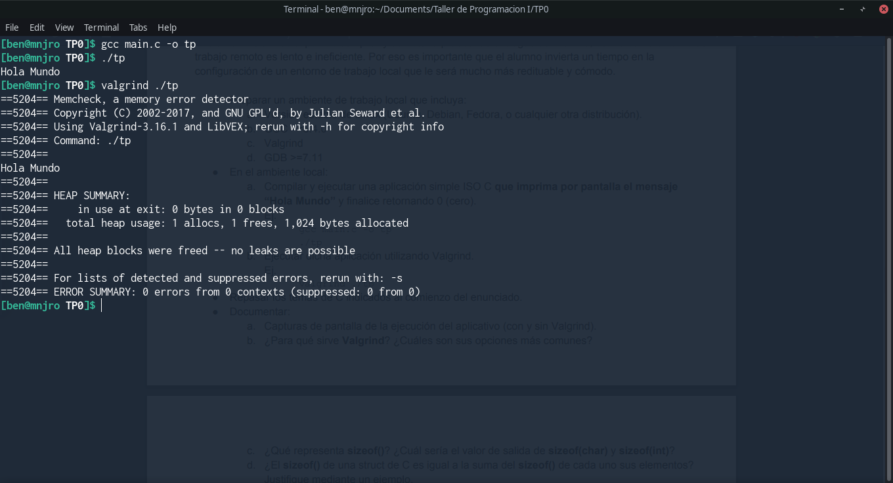
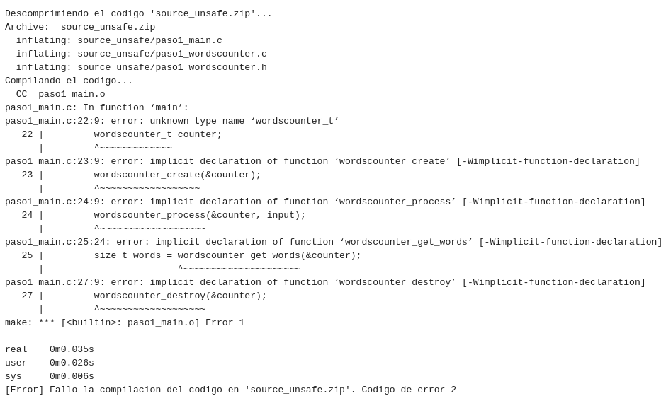
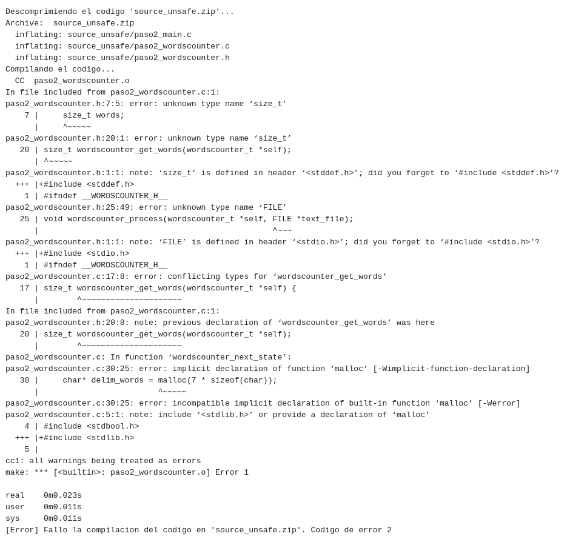
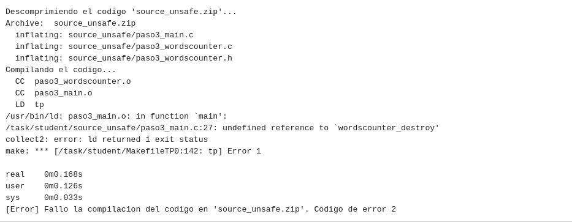
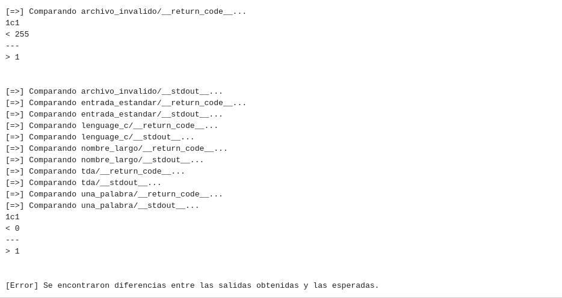
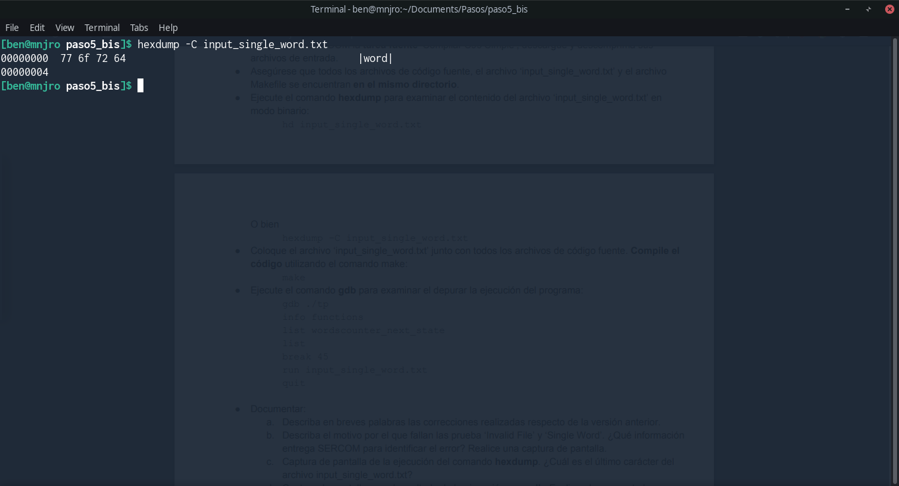
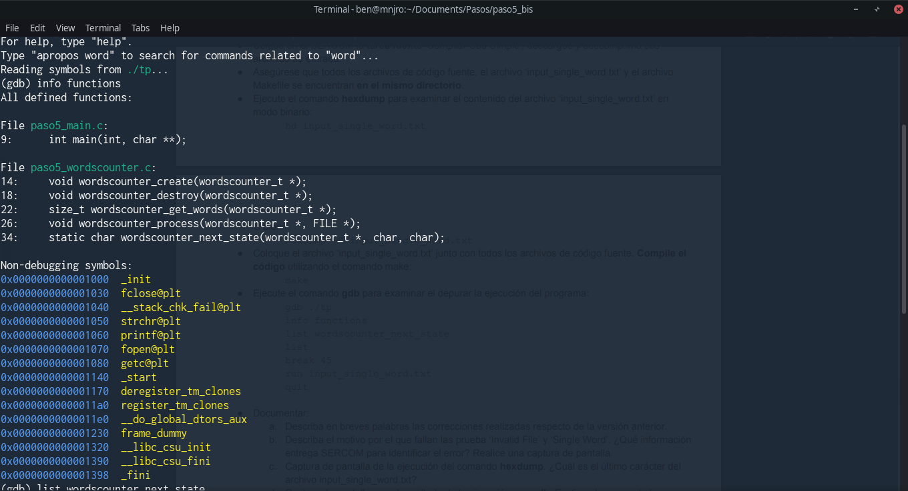
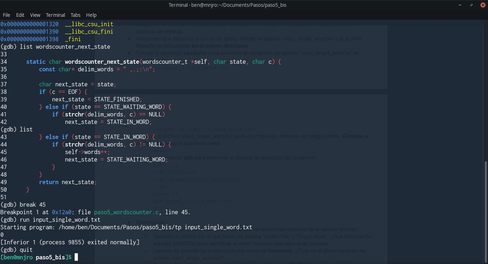
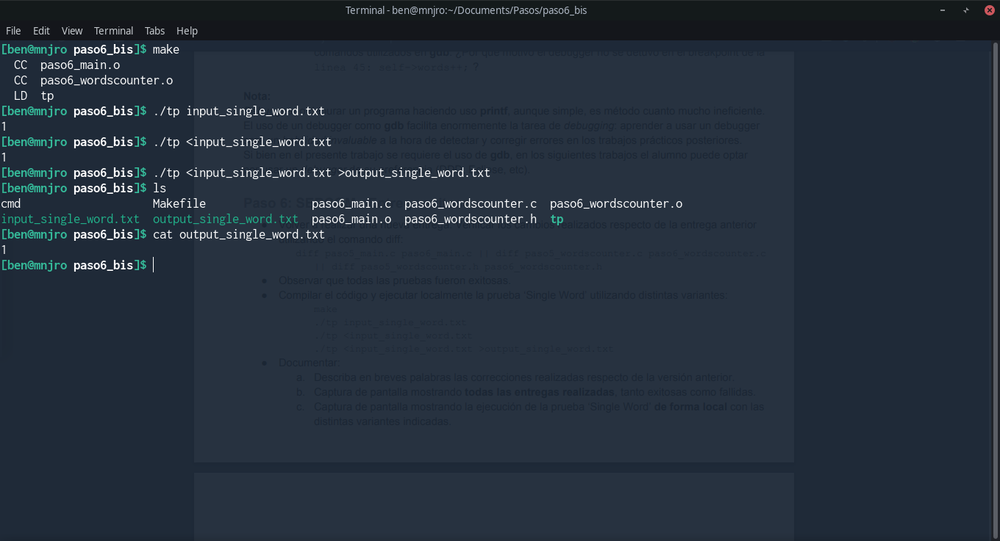

# TP0

Nombre completo: Sebastian Bento Inneo Veiga

Padron: 100998

Link: https://github.com/SBen-IV/tp0

## Paso 0: Entorno de Trabajo

**a.** Capturas de pantalla de la ejecución del aplicativo (con y sin Valgrind).



**b.** ¿Para qué sirve Valgrind? ¿Cuáles son sus opciones más comunes?

Valgrind es usado para detectar mal uso de memoria en un programa, por ejemplo, al hacer uso de `malloc()` sin haber hecho `free()`.

**c.** ¿Qué representa sizeof()? ¿Cuál sería el valor de salida de sizeof(char) y sizeof(int)?

`sizeof()` es una función que devuelve el tamaño en bytes del tipo de dato de la variable que se le pasa por parámetro. El valor que devuelva va a depender de la arquitectura en la que se encuentre el programa, por ejemplo, en 32 bits el tamaño de un `short` será de 2 bytes mientras que en 64 bits será de 4 bytes.

> No necesariamente, depende del modelo de datos. En los modelos LP64 (los más habituales), short es de 2 bytes

**d.** ¿El sizeof() de una struct de C es igual a la suma del sizeof() de cada uno sus elementos?
Justifique mediante un ejemplo.

En la mayoría de los casos esto no es cierto, por ejemplo, si se tiene la estructura (en 32 bits):

```c
typedef struct Ejemplo{
	short a;
	int b;
};
```
`sizeof(short)` + `sizeof(int)` = 2 + 4 = 6, pero si hacemos `sizeof(Ejemplo)` = 8 =! 6.

Esto ocurre porque se agrega un *padding* a la estructura de modo que sus miembros queden en direcciones de memoria múltiplos de 4. En este caso queda así:

0 | 1 | 2 | 3
------|-------|----|----
short | short | x | x
int | int | int | int 

(x = padding)

**e.** Investigar la existencia de los archivos estándar: STDIN, STDOUT, STDERR. Explicar
brevemente su uso y cómo redirigirlos en caso de ser necesario (caracteres > y <) y como
conectar la salida estándar de un proceso a la entrada estándar de otro con un pipe (carácter
| ).

STDIN: Se usa para almacenar lo que se ingresa por teclado. Se puede redirigir con `porgrama1 < programa2`.

STDOUT: Se usa para almacenar lo que se imprime por pantalla en la terminal. Se puede redirigir con `programa1 > programa2` o `programa1 1> programa2`. 

STDERR: Se usa para almacenar la salida sobre errores de los programas. Se puede redirigir con `programa1 2> programa2`.

Para conectar la salida estándar con la entrada estándar de 2 procesos se puede usar un pipe de la siguiente manera:

`programa_con_salida_estandar | programa_con_entrada_estandar`


## Paso 1: SERCOM - Errores de generación y normas de programación

**a.** Captura de pantalla mostrando los problemas de estilo detectados. Explicar cada uno.

```
/task/student//source_unsafe/paso1_wordscounter.c:27:  Missing space before ( in while(  [whitespace/parens] [5]
```
Hace referencia a que falta un espacio antes del `(` del `while` en el archivo `paso1_wordscounter.c` en la línea 27.
```
/task/student//source_unsafe/paso1_wordscounter.c:41:  Mismatching spaces inside () in if  [whitespace/parens] [5]
```
La cantidad de espacios entre `(`, la condición y `)` no es igual en el archivo `paso1_wordscounter.c` en la línea 41.
```
/task/student//source_unsafe/paso1_wordscounter.c:41:  Should have zero or one spaces inside ( and ) in if  [whitespace/parens] [5]
```
Parecido al error anterior, indica que deben haber 1 o ningún espacio dentro de los paréntesis `()` en el archivo `paso1_wordcounter.c` en la ĺínea 41.
```
/task/student//source_unsafe/paso1_wordscounter.c:47:  An else should appear on the same line as the preceding }  [whitespace/newline] [4]
```
Al tener un estructura `if` y agregar un `else` este último debe ir en la misma línea que el `}` que cierra el bloque del `if` en el archivo `paso1_wordscounter.c`, línea 47.
```
/task/student//source_unsafe/paso1_wordscounter.c:47:  If an else has a brace on one side, it should have it on both  [readability/braces] [5]
```
Si se usan llaves en un `if` deberían usarse también en su respectivo `else if` / `else` y viceversa. 
```
/task/student//source_unsafe/paso1_wordscounter.c:48:  Missing space before ( in if(  [whitespace/parens] [5]
```
Falta un espacio entre `if` y `(` en el archivo `paso1_wordscounter.c` en la línea 48.
```
/task/student//source_unsafe/paso1_wordscounter.c:53:  Extra space before last semicolon. If this should be an empty statement, use {} instead.  [whitespace/semicolon] [5]
```
Hay un espacio de más antes de un `;` en el archivo `paso1_wordscounter.c` en la línea 53. Como el programa de detección de errores no sabe si se trata de sólo un espacio de más o si se quería hacer una declaración vacía, recomienda usar `{}`.
```
/task/student//source_unsafe/paso1_wordscounter.h:5:  Lines should be <= 80 characters long  [whitespace/line_length] [2]
```
Cada línea debería tener no más de 80 caracteres. Esto lo indica en el archivo `paso1_wordscounter.h`, línea 5.
```
/task/student//source_unsafe/paso1_main.c:12:  Almost always, snprintf is better than strcpy  [runtime/printf] [4]
```
Sugiere utilizar `snprintf` en vez de `strcpy` porque este último no toma en cuenta la cantidad de bytes a escribir y podría llevar a un overflow. Este se indica en el archivo `paso1_main.c`, línea 12.
```
/task/student//source_unsafe/paso1_main.c:15:  An else should appear on the same line as the preceding }  [whitespace/newline] [4]
```
`else` debería estar en la misma línea que `}` del `if`. Indicado en el archivo `paso1_main.c`, línea 15.
```
/task/student//source_unsafe/paso1_main.c:15:  If an else has a brace on one side, it should have it on both  [readability/braces] [5]
```
Si se usan llaves en un `if` deberían usarse también en su respectivo `else if` / `else` y viceversa.
```
Done processing /task/student//source_unsafe/paso1_wordscounter.c
Done processing /task/student//source_unsafe/paso1_wordscounter.h
Done processing /task/student//source_unsafe/paso1_main.c
Total errors found: 11
```
Se terminaron de procesar los archivos. La última línea indica la cantidad de errores encontrados.


**b.** Captura de pantalla indicando los errores de generación del ejecutable. Explicar cada uno e indicar si se trata de errores del compilador o del linker.



Todos los errores son del archivo `paso1_main.c` y se refiere a que el tipo de dato `wordscounter_t` y las funciones `wordscounter_create`, `wordscounter_process`, `wordscounter_get_words` y `wordscounter_destroy` no fueron declaradas. Se trata de un error del compilador, dado que no están declaradas el tipo de dato y las funciones no tiene forma de saber cuánto espacio ocupará cada una.

**c.** ¿El sistema reportó algún WARNING? ¿Por qué?

No, porque se compiló con el flag `-Werror` que trata a todos los `warning` como errores.

## Paso 2: SERCOM - Errores de generación 2

**a.** Describa en breves palabras las correcciones realizadas respecto de la versión anterior.

En `paso2_main.c` se incluyó la biblioteca `paso2_wordscounter.h`, se cambió `strcpy` por `memcpy` para un uso más seguro de memoria y se ubicó el `else` de la línea 15 al lado del `}`.
En `paso2_wordscounter.c` se ubicó  `{` de la línea 14 al lado de la declaración de la función, se agregó un espacio entre el `while` y `(` de la línea 27, se borraron los espacios extra de la condición del `if` de la línea 40, se ubicó el `else if` al lado de `}` en la línea 45 y se borró el espacio extra entre el valor de retorno y el `;` en la línea 51.
En `paso2_wordscounter.h` se disminuyó la cantidad de caracteres en la línea 5.

**b.** Captura de pantalla indicando la correcta ejecución de verificación de normas de
programación.


**c.** Captura de pantalla indicando los errores de generación del ejecutable. Explicar cada uno e indicar si se trata de errores del compilador o del linker.



Todos los errores son del compilador, dado que no se incluyeron las bibliotecas `stdio.h`, `stdlib.h` y `stddef.h` en `paso2_wordscounter.h` el mismo no puede saber el tamaño de `size_t` y `FILE` ni cómo está definida la función `malloc`.

## Paso 3 - Errores de generación 3

**a.** Describa en breves palabras las correcciones realizadas respecto de la versión anterior.

En `paso3_wordscounter.c` se incluyó la biblioteca `stdlib.h`.
En `paso3_wordscounter.h` se incluyeron las bibliotecas `string.h` y `stdio.h`.
Al agregar las bibliotecas mencionadas ya no hay errores de declaración de las funciones/tipo de datos que no estaban definidas.

**b.** Captura de pantalla indicando los errores de generación del ejecutable. Explicar cada uno e indicar si se trata de errores del compilador o del linker.



El único error que hay es del linker porque falta la definición de la función `wordscounter_destroy`.

## Paso 4: SERCOM - Memory Leaks y Buffer Overflows

**a.** Describa en breves palabras las correcciones realizadas respecto de la versión anterior.

El único cambio que se realizó fue definir la función `wordscounter_destroy` en `paso4_wordscounter.c` de modo que se pudiera completar la compilación del programa.

**b.** Captura de pantalla del resultado de ejecución con Valgrind de la prueba ‘TDA’. Describir los errores reportados por Valgrind.

```
[=>] Executando el caso '/task/student//cases/tda' (con valgrind)...
[=>] Command line: /usr/bin/valgrind
                --tool=memcheck
                --leak-check=full --leak-resolution=med --show-reachable=yes
                --trace-children=yes
                --track-fds=yes
                --track-origins=no
                --time-stamp=yes --num-callers=20
                --error-exitcode=42
                --log-file=__valgrind__
                --suppressions=/task/student/suppressions.txt ./tp input_tda.txt

real    0m1.037s
user    0m0.885s
sys     0m0.094s

==00:00:00:00.000 59== Memcheck, a memory error detector
==00:00:00:00.000 59== Copyright (C) 2002-2017, and GNU GPL'd, by Julian Seward et al.
==00:00:00:00.000 59== Using Valgrind-3.15.0 and LibVEX; rerun with -h for copyright info
==00:00:00:00.000 59== Command: ./tp input_tda.txt
==00:00:00:00.000 59== Parent PID: 58
==00:00:00:00.000 59==
==00:00:00:01.005 59==
==00:00:00:01.005 59== FILE DESCRIPTORS: 5 open at exit.
==00:00:00:01.005 59== Open file descriptor 4: input_tda.txt
==00:00:00:01.005 59==    at 0x495FEAB: open (open64.c:48)
==00:00:00:01.005 59==    by 0x48E2195: _IO_file_open (fileops.c:189)
==00:00:00:01.005 59==    by 0x48E2459: _IO_file_fopen@@GLIBC_2.2.5 (fileops.c:281)
==00:00:00:01.005 59==    by 0x48D4B0D: __fopen_internal (iofopen.c:75)
==00:00:00:01.005 59==    by 0x48D4B0D: fopen@@GLIBC_2.2.5 (iofopen.c:86)
==00:00:00:01.005 59==    by 0x109177: main (paso4_main.c:14)
==00:00:00:01.005 59==
==00:00:00:01.005 59== Open file descriptor 3: /task/student/cases/tda/__valgrind__
==00:00:00:01.005 59==    <inherited from parent>
==00:00:00:01.005 59==
==00:00:00:01.005 59== Open file descriptor 2: /task/student/cases/tda/__stderr__
==00:00:00:01.005 59==    <inherited from parent>
==00:00:00:01.005 59==
==00:00:00:01.005 59== Open file descriptor 1: /task/student/cases/tda/__stdout__
==00:00:00:01.005 59==    <inherited from parent>
==00:00:00:01.005 59==
==00:00:00:01.005 59== Open file descriptor 0: /task/student/cases/tda/__stdin__
==00:00:00:01.005 59==    <inherited from parent>
==00:00:00:01.005 59==
==00:00:00:01.005 59==
==00:00:00:01.005 59== HEAP SUMMARY:
==00:00:00:01.005 59==     in use at exit: 1,977 bytes in 216 blocks
==00:00:00:01.005 59==   total heap usage: 218 allocs, 2 frees, 10,169 bytes allocated
```
Se hizo uso de más memoria de la que se liberó. En este caso, se hicieron 218 `malloc` pero sólo 2 `free`.

```
==00:00:00:01.005 59==
==00:00:00:01.006 59== 472 bytes in 1 blocks are still reachable in loss record 1 of 2
==00:00:00:01.006 59==    at 0x483B7F3: malloc (in /usr/lib/x86_64-linux-gnu/valgrind/vgpreload_memcheck-amd64-linux.so)
==00:00:00:01.006 59==    by 0x48D4AAD: __fopen_internal (iofopen.c:65)
==00:00:00:01.006 59==    by 0x48D4AAD: fopen@@GLIBC_2.2.5 (iofopen.c:86)
==00:00:00:01.006 59==    by 0x109177: main (paso4_main.c:14)
==00:00:00:01.006 59==
==00:00:00:01.006 59== 1,505 bytes in 215 blocks are definitely lost in loss record 2 of 2
==00:00:00:01.006 59==    at 0x483B7F3: malloc (in /usr/lib/x86_64-linux-gnu/valgrind/vgpreload_memcheck-amd64-linux.so)
==00:00:00:01.006 59==    by 0x109301: wordscounter_next_state (paso4_wordscounter.c:35)
==00:00:00:01.006 59==    by 0x1093B5: wordscounter_process (paso4_wordscounter.c:30)
==00:00:00:01.006 59==    by 0x109197: main (paso4_main.c:24)
==00:00:00:01.006 59==
==00:00:00:01.006 59== LEAK SUMMARY:
==00:00:00:01.006 59==    definitely lost: 1,505 bytes in 215 blocks
==00:00:00:01.006 59==    indirectly lost: 0 bytes in 0 blocks
==00:00:00:01.006 59==      possibly lost: 0 bytes in 0 blocks
==00:00:00:01.006 59==    still reachable: 472 bytes in 1 blocks
==00:00:00:01.006 59==         suppressed: 0 bytes in 0 blocks
==00:00:00:01.006 59==
```
Acá se hace un resumen de la memoria que se perdió y la que se pudo alcanzar y liberar aún sin haberlo hecho explícitamente en el programa.

> `definitely lost` es memoria para la cual no hay puntero que le referencie
> `still reacheable` es memoria para la cual hay alguna referencia viva

```
==00:00:00:01.006 59== For lists of detected and suppressed errors, rerun with: -s
==00:00:00:01.006 59== ERROR SUMMARY: 1 errors from 1 contexts (suppressed: 0 from 0)
```

**c.** Captura de pantalla del resultado de ejecución con Valgrind de la prueba ‘Long Filename’. Describir los errores reportados por Valgrind.

```
[=>] Executando el caso '/task/student//cases/nombre_largo' (con valgrind)...
[=>] Command line: /usr/bin/valgrind
                --tool=memcheck
                --leak-check=full --leak-resolution=med --show-reachable=yes
                --trace-children=yes
                --track-fds=yes
                --track-origins=no
                --time-stamp=yes --num-callers=20
                --error-exitcode=42
                --log-file=__valgrind__
                --suppressions=/task/student/suppressions.txt ./tp input_extremely_long_filename.txt

real    0m0.904s
user    0m0.765s
sys     0m0.089s

**00:00:00:00.850 47** *** memcpy_chk: buffer overflow detected ***: program terminated
```
Se detectó un buffer overflow en memcpy_chk.
```
==00:00:00:00.000 47== Memcheck, a memory error detector
==00:00:00:00.000 47== Copyright (C) 2002-2017, and GNU GPL'd, by Julian Seward et al.
==00:00:00:00.000 47== Using Valgrind-3.15.0 and LibVEX; rerun with -h for copyright info
==00:00:00:00.000 47== Command: ./tp input_extremely_long_filename.txt
==00:00:00:00.000 47== Parent PID: 46
==00:00:00:00.000 47==
**00:00:00:00.850 47** *** memcpy_chk: buffer overflow detected ***: program terminated
==00:00:00:00.850 47==    at 0x483E9CC: ??? (in /usr/lib/x86_64-linux-gnu/valgrind/vgpreload_memcheck-amd64-linux.so)
==00:00:00:00.851 47==    by 0x4843C0A: __memcpy_chk (in /usr/lib/x86_64-linux-gnu/valgrind/vgpreload_memcheck-amd64-linux.so)
==00:00:00:00.851 47==    by 0x109168: memcpy (string_fortified.h:34)
==00:00:00:00.851 47==    by 0x109168: main (paso4_main.c:13)
==00:00:00:00.874 47==
```
El error de buffer overflow proviene del llamado a `memcpy` en `main`, línea 13.
```
==00:00:00:00.874 47== FILE DESCRIPTORS: 4 open at exit.
==00:00:00:00.874 47== Open file descriptor 3: /task/student/cases/nombre_largo/__valgrind__
==00:00:00:00.874 47==    <inherited from parent>
==00:00:00:00.874 47==
==00:00:00:00.874 47== Open file descriptor 2: /task/student/cases/nombre_largo/__stderr__
==00:00:00:00.874 47==    <inherited from parent>
==00:00:00:00.874 47==
==00:00:00:00.874 47== Open file descriptor 1: /task/student/cases/nombre_largo/__stdout__
==00:00:00:00.874 47==    <inherited from parent>
==00:00:00:00.874 47==
==00:00:00:00.874 47== Open file descriptor 0: /task/student/cases/nombre_largo/__stdin__
==00:00:00:00.874 47==    <inherited from parent>
==00:00:00:00.874 47==
==00:00:00:00.874 47==
==00:00:00:00.874 47== HEAP SUMMARY:
==00:00:00:00.874 47==     in use at exit: 0 bytes in 0 blocks
==00:00:00:00.874 47==   total heap usage: 0 allocs, 0 frees, 0 bytes allocated
==00:00:00:00.874 47==
==00:00:00:00.874 47== All heap blocks were freed -- no leaks are possible
==00:00:00:00.874 47==
==00:00:00:00.874 47== For lists of detected and suppressed errors, rerun with: -s
==00:00:00:00.874 47== ERROR SUMMARY: 0 errors from 0 contexts (suppressed: 0 from 0)
```

**d.** ¿Podría solucionarse este error utilizando la función strncpy? ¿Qué hubiera ocurrido con la ejecución de la prueba?

No, hubiera pasado lo mismo dado que las funciones `memcpy` y `strncpy` no verifican que la cantiadad de bytes que se copian pueda ser mayor a la cantidad de espacio que tiene el vector en el que se quiere guardar el nuevo valor.

**e.** Explicar de qué se trata un segmentation fault y un buffer overflow

Un segmentation fault sucede cuando un programa quiere acceder (normalmente a través de una variable) a un espacio de memoria que no le pertenece.

Un buffer overflow es cuando se pasa del tamaño de la variable que almacena el valor proveniente del input.

> Un segmentation fault es cuando se intenta realizar una **operación no permitida** sobre un segmento de memoria, por ejemplo, leer un segmento que no me pertenece, o escribir en uno que es solo lectura, como el code segment.
> Como dato de color Esta operación es detectada por hardware (la MMU lo detecta), y lanza una señal al sistema operativo. Esta señal es el famoso *SIGSEGV*. El buffer overflow es dentro del mismo segmento de memoria, no es advertido por hardware (es más peligroso).

## Paso 5: SERCOM - Código de retorno y salida estándar

**a.** Describa en breves palabras las correcciones realizadas respecto de la versión anterior.

En `paso5_main.c` se quitó `memcpy` (usando `argv[1]` como nombre de archivo directamente).
En `paso5_wordscounter.c` se modificó `delim_words`, ahora no se pide memoria del heap para guardar los valores y pasó a ser una constante.


**b.** Describa el motivo por el que fallan las prueba ‘Invalid File’ y ‘Single Word’. ¿Qué información entrega SERCOM para identificar el error? Realice una captura de pantalla.

Las pruebas fallan porque el programa no devuelve los valores esperados. SECROM los muestra de la siguiente forma, siendo el primer valor el devuelto por el programa y el segundo valor el esperado:



**c.** Captura de pantalla de la ejecución del comando hexdump. ¿Cuál es el último carácter del archivo input_single_word.txt?



El último caracter es la `d` haciendo que el programa no detecte cuándo se llegó al final del archivo.

**d.** Captura de pantalla con el resultado de la ejecución con gdb. Explique brevemente los comandos utilizados en gdb. ¿Por qué motivo el debugger no se detuvo en el breakpoint de la línea 45: self->words++; ?





Comandos:

`info functions` devuelve las declaraciones de las funciones usadas y definidas por el programador del programa, también devuelve información de las funciones de otras librerías (en el caso de la foto, como no fueron compilados con el flag -g no puede recuperar más información).

`list` imprime (por defecto) 10 líneas desde donde está el puntero. Si se pasa el nombre de una función, imprime 10 líneas a partir de la declaración de la misma. También se puede pasar un número positivo para que imprima una mayor o menor cantidad de líneas.

`break` obliga al programa a parar su ejecución una vez pasa por la línea ejecutada que se le indica con un número entero positivo.

`run` empieza a correr el programa.

`quit` sale de GDB.

El debugger no se detuvo en la línea 45 porque el programa nunca entró al condicional que lo contiene, por lo tanto, nunca se llegó a ejecutar esa línea.

## Paso 6: SERCOM - Entrega exitosa

**a.** Describa en breves palabras las correcciones realizadas respecto de la versión anterior.

En `paso6_main.c` se cambió el valor de la constante `ERROR` de -1 a 1.
En `paso6_wordscounter.c` se declaró la constante `DELIM_WORDS` con `#define`, se modificó el orden de los condicionales, ahora primero verifica si está o no en una palabra y luego si es fin de archivo.

**b.** Captura de pantalla mostrando todas las entregas realizadas, tanto exitosas como fallidas.


**c.** Captura de pantalla mostrando la ejecución de la prueba ‘Single Word’ de forma local con las distintas variantes indicadas. 

